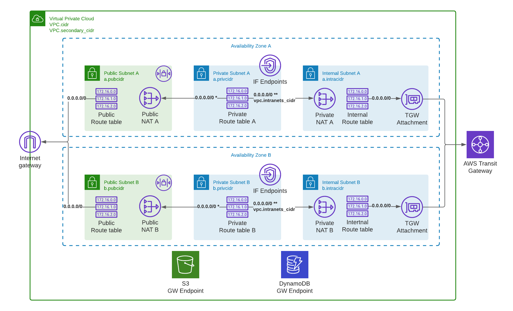

## AWS VPC template

This is an Cloudformation template for deploying and maintaining VPCs
as described in [Networking meets Agile Deployment](https://carriagereturn.nl/aws/vpc/network/nat/2021/06/15/agile-networking.html) -blog post. My goal was to

* Allow quick VPC deployment to get started building a POC for a new ideas.
* Be able to maintain the VPC via Cloudformation stack when new networking
requirement are introduced, without discarding everything build so far.
* Have human readble YAML code that can be extented with new features.

With `vpc.yaml` you can start deploying independent VPC with it's own
internet gateway and standard public and private subnet layers. This can
be later extented with dedicated layer for transit gateway connectivity
and if required local internet gateway can even be removed simply by
updating the stack parameters. It also supports some exotic configurations
such as VPC that has only private subnets where all connectivity to outside
world is via service endpoints.

NOTE: Not all combinations of changes are tested to be working. Recommendation
is to do one change at the time. Ie. first update stack to remove resources
and then do second update to add new resources.

### Template features
* VPC
* Internet gataway
* Public, private and internal subnet for each AZ
* Shared routing table for public & internal subnets and dedicated tables for each private subnet
* Public NAT gateway for each AZ when there is both public and private subnet
* Private NAT gateway for each AZ when there is private subnet with transit gateway attachment
* Option to use pre-allocated EIPs for Public NAT gateways
* Options for default route from private subnets via public or private NAT gateway in same AZ
* VPC S3 and DynamoDB gateway end-points and routing for every subnet
* Option for VPC interface end-points for private subnets
* Outputs as
   * Cloudformation stack exports
   * SSM parameterstore parameters



### Template parameters

#### VPC CIDR(s)
   * VpcCidr
   * VpcIntraCidr

Primary and secondary CIDRs. `VpcCidr` covers private and public subnets,
`VpcIntraCidr` is for internal subnets.

_NOTE:_ There are several restrictions for VPC CIDR ranges and sizes. See https://docs.aws.amazon.com/vpc/latest/userguide/VPC_Subnets.html#VPC_Sizing

#### Public subnets
   * PubCidrX

`PubCidrX` is CIDR for public subnet you want to deploy. Leaving the parameter
empty will not deploy the subnet or NAT in given AZ. If you don't deploy public
subnet, then there won't be a route to internet, via IGW, from private subnet
in the same AZ. Public subnets are for resources you want to expose to internet.
Typically these are NATs and internet facing load-balancers. 

_NOTE:_ Default route from public subnet is always to local IGW and access to internal
subnets or TGW is blocked by network access control list (NACL).

#### Private subnets
   * PrivCidrX
   * DefaultRouting
   * InterfaceEndpoints

`PrivCidrX`is CIDR for private subnet you want to deploy. Leaving the parameter
empty will not deploy the subnet in given AZ. `DefaultRouting` can be either via
public NAT and local IGW or private NAT and TGW. NAT instance must be in the same
AZ and private subnet. `InterfaceEndpoints` will choose if VPC interface endpoints
will be deployed into private subnets or not.

#### Internal subnets
   * IntraCidrX
   * IntraCIDR
   * TransitGwId

`IntraCidrX` is CIDR for internal subnet you want to deploy. Leaving the parameter
empty will not deploy the subnet in given AZ. `IntraCIDR` will determine what
traffic will be routed to TGW. `TransitGwId` is TGW ID that should be attached
to internal subnets. Private NAT is deployed to each subnet when TGW is attached.

_NOTE:_ Default route from internal subnet is always to TGW and access to public
subnets or IGW is blocked by network access control list (NACL).

### Outputs:

|Value |Export |Parameter |
|------|-------|----------|
|VPC ID|{STACKNAME}-VpcId|/cloudformation/{STACKNAME}/vpcid|
|Public Subnets|{STACKNAME}-PubSubnets|/cloudformation/{STACKNAME}/pubsubnets|
|Private Subnets|{STACKNAME}-PrivSubnets|/cloudformation/{STACKNAME}/privsubnets|
|Internal Subnets|{STACKNAME}-IntraSubnets|/cloudformation/{STACKNAME}/intrasubnets|


### Rendering the template

The Easiest way to use pre-rendered template `vpc.yaml`. This is ready to be used out-of-the-box. I have done my best to keep it human readable and minor changes
should be possible to do simply by editing YAML.

`vpc.yaml.j2` is Jinja2 template that will generate Cloudformation YAML template with
input from `config.json` in this same directory. To render `vpc.yaml` you need to

* Install Jinja CLI

```
% pip install jinja-cli
``` 

* Render Cloudformation template

``` 
% jinja2 vpc.yaml.j2 config.json > vpc.yaml
```

Or simply run `./build.sh` that will do above and validate the output with cfn-lint.

### config.json

In configuration file you can set default values for template parameters,
define what AZs template should cover and list interface endpoints you
want to provision.

`cidr` is the primary VPC CIDR that covers public and private subnets. `secondary_cidr`
is for intranet subnets. `intranets_cidr` should cover all intranet you can connect via
transit gateway, and also your local intranet subnets.

```
{
    "VPC": {
      "cidr": "10.0.0.0/21",
      "secondary_cidr": "100.64.0.0/24",
      "intranets_cidr": "100.64.0.0/10"
    },
```

`AZ` -array defines what availability zones your template can cover and default values
for respective subnets. Subnet CIDRs must be covered by VPC CIDRs defined above. An empty
subnet CIDR means subnet won't be deployed. This allows you to render template that supports
all AZs but deploy only the ones you need. E.g for development environment you could deploy
only 2 AZs, but use 3 AZs in testing and production.

```
    "AZ": [
        {
            "az": "a",
            "pubcidr": "10.0.0.0/24",
            "privcidr":  "10.0.4.0/24",
            "intracidr": "100.64.0.0/26"
        },
        {
            "az": "b",
            "pubcidr": "10.0.1.0/24",
            "privcidr":  "10.0.5.0/24",
            "intracidr": "100.64.0.64/26"
        },
        {
            "az": "c",
            "pubcidr": "",
            "privcidr":  "",
            "intracidr": ""
        }
    ],
```

`Pattern` shouldn't be edited. These are to validate input values for CIDRs are formated
correctly and match VPC and subnet minimum and maximum sizes.

```
    "Pattern": {
        "VPC_PRIMARY_CIDR": "^(([0-9]|[1-9][0-9]|1[0-9]{2}|2[0-4][0-9]|25[0-5])\\\\.){3}([0-9]|[1-9][0-9]|1[0-9]{2}|2[0-4][0-9]|25[0-5])(\\\\/(1[6-9]|2[0-8]))$",
        "VPC_SECONDARY_CIDR": "^((([01]?[0-9]?[0-9]|2([0-4][0-9]|5[0-5]))\\\\.){3}([01]?[0-9]?[0-9]|2([0-4][0-9]|5[0-5]))/([0-2]?[0-9]|3[0-2])){0,1}$",
        "VPC_SUBNET_CIDR": "^((([01]?[0-9]?[0-9]|2([0-4][0-9]|5[0-5]))\\\\.){3}([01]?[0-9]?[0-9]|2([0-4][0-9]|5[0-5]))/([0-2]?[0-9]|3[0-2])){0,1}$"
    },
```

`InterfaceEndpoints` is a list of AWS endpoints that will be deployed into VPC.
`name` is just an unique name for a resource in the template. `addr` is
the name of endpoint, e.g. `ec2` is for `com.amazonaws.REGION.ec2`.


```
    "InterfaceEndpoints": [
        { "name": "SSM", "addr": "ssm" },
        { "name": "EC2", "addr": "ec2" },
        { "name": "SSMMSG", "addr": "ssmmessages" },
        { "name": "EC2MSG", "addr": "ec2messages" },
        { "name": "CFN", "addr": "cloudformation" }
    ]
}
```


